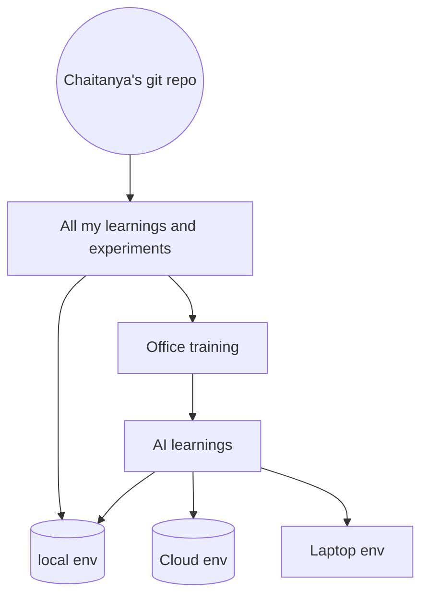

# vurachaitanya.github.io
Hi i am learning python from vscode

## About

```mermaid
graph TD
    id1`((Chaitanya's git repo)) --> A[All my learnings and experiments]
    A --> B[(Attended training)]
    A --> C[ Office training ];
    C --> D[AI learnings];
    D --> B[(local env)]; 
    D --> H[(Cloud env)]; 
    D --> G[Laptop env]
```
